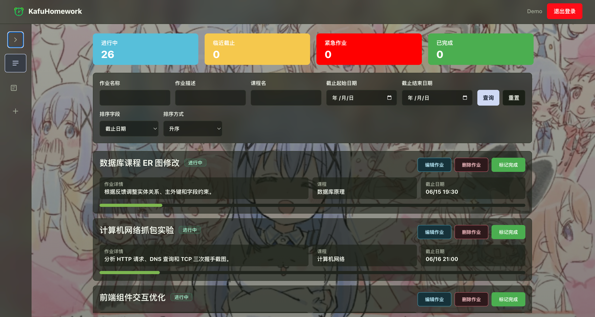
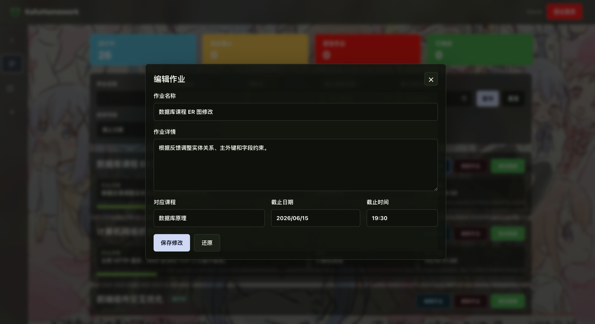
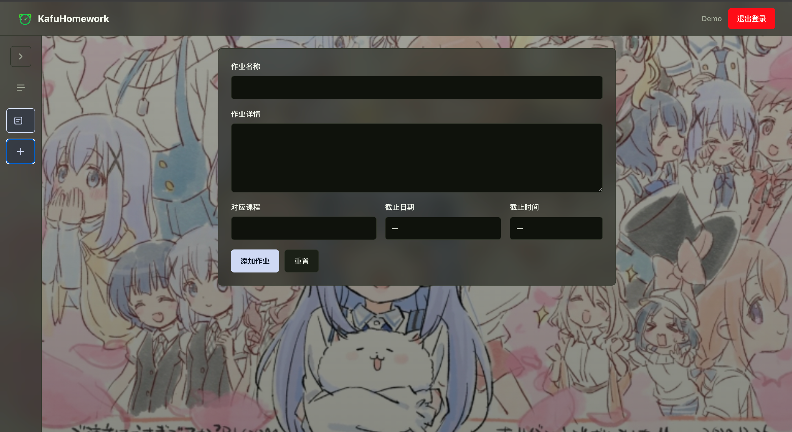

# KafuHomework




---

- 作业使用 **纯HTML、CSS、JavaScript** 实现。并已完成 **所有基础与附加功能**。

- 项目代码已添加注释

- 效果网页一键访问：[KafuHomework](https://kyy008.github.io/KafuHomework/)

这里注意，由于 GitHub Pages 只能托管静态页面，因此预览版使用 demo 登录和 localStorage 示例数据，无法体验真实后端注册、登录会话和服务器端数据保存。若想体验完整功能，需要执行以下步骤：
    1. 克隆项目：`git clone https://github.com/Kyy008/KafuHomework.git`
    2. 进入目录：`cd KafuHomework`
    3. 安装依赖：`npm install`
    4. 启动前后端服务：`npm run dev`
    5. 浏览器访问：`http://localhost:5173/KafuHomework/`

## 1. 组件结构

本项目采用组件化方式组织界面，将登录、整体布局、作业查看、作业列表、作业表单等功能拆分到不同组件中。`App` 作为根组件负责组合页面结构和管理当前视图，具体业务界面由子组件完成。

```
App
├── AuthPage                ← 登录/注册页面
├── Topbar                  ← 顶部栏，展示用户信息和退出登录入口
├── Sidebar                 ← 桌面端侧边导航，切换查看/添加作业
├── MobileBottomNav         ← 移动端底部导航
└── ViewAssignments         ← 作业查看主页面
    ├── StatsSection        ← 作业状态统计
    ├── AssignmentQueryPanel ← 查询、筛选、排序区域
    ├── AssignmentList      ← 作业列表
    │   └── AssignmentCard  ← 单条作业卡片
    ├── AssignmentPagination ← 分页控件
    ├── EditAssignmentDialog ← 编辑作业弹窗
    └── AssignmentForm      ← 添加/编辑作业表单
```

各组件职责说明：

| 组件 | 职责 |
|------|------|
| App | 根组件，负责登录状态判断、整体布局、当前视图切换以及作业数据状态的连接 |
| AuthPage | 提供登录和注册表单，完成用户名、密码和确认密码的基础校验 |
| Topbar | 展示应用名称、当前用户名，并提供退出登录按钮 |
| Sidebar / MobileBottomNav | 提供桌面端和移动端导航，用于切换“查看作业”和“添加作业” |
| ViewAssignments | 作业查看页面容器，负责查询、排序、分页、统计和编辑弹窗的组合 |
| StatsSection | 根据当前查询结果统计进行中、临近截止、紧急和已完成作业数量 |
| AssignmentQueryPanel | 提供作业名称、详情、课程、日期范围查询，以及排序字段/方式选择 |
| AssignmentList | 渲染作业列表，并在自定义排序模式下支持拖拽排序和边缘自动滚动 |
| AssignmentCard | 展示单条作业的名称、课程、详情、截止时间、进度和操作按钮 |
| AssignmentPagination | 控制每页显示数量和页码切换 |
| AssignmentForm | 复用为添加和编辑表单，负责作业名称、详情、课程、截止日期和时间输入 |
| EditAssignmentDialog | 以弹窗形式包裹 `AssignmentForm`，用于编辑已有作业 |

## 2. 功能实现说明

核心**增删改查**基础功能说明：

| 功能 | 实现方式 |
|------|----------|
| 增加信息 | 在 `App` 中切换到“添加作业”视图后，使用 `AssignmentForm` 输入作业名称、详情、课程、截止日期和截止时间。提交时先进行表单校验，通过后调用 `useAssignmentStore` 中的 `addAssignment` 方法，将新作业加入 `assignments` 状态，并自动跳转回查看页面。 |
| 删除信息 | 每个 `AssignmentCard` 都提供“删除作业”按钮。点击后先弹出确认框，确认删除后调用父组件传入的 `onDelete` 回调，最终由 `useAssignmentStore` 中的 `deleteAssignment` 根据 `id` 从作业数组中过滤删除。 |
| 修改信息 | 每个作业卡片提供“编辑作业”按钮。点击后打开 `EditAssignmentDialog` 弹窗，并复用 `AssignmentForm` 回填当前作业数据。保存时调用 `saveAssignment`，根据作业 `id` 更新对应作业的名称、详情、课程和截止时间。 |
| 查询信息 | 在 `AssignmentQueryPanel` 中输入作业名称、作业详情、课程名，或设置截止日期范围后点击查询。`ViewAssignments` 会根据查询条件过滤 `assignments`，只展示符合条件的作业；若起始日期晚于结束日期，会显示错误提示。 |

除基础增删改查外，项目还实现了以下核心功能，提升用户体验：

| 功能 | 实现方式 |
|------|----------|
| 作业状态统计 | `StatsSection` 根据当前查询结果统计进行中、临近截止、紧急作业和已完成作业数量，帮助用户快速了解当前作业完成情况。 |
| 截止状态提示 | `getAssignmentStatus` 会根据作业截止时间和当前时间自动判断状态，并在作业卡片中显示“进行中”“临近”“紧急”“已完成”等标签。 |
| 作业进度展示 | `calculateAssignmentProgress` 根据创建时间、当前时间和截止时间计算时间进度，并通过进度条展示；进度条颜色会随着进度变化从绿色逐渐过渡到黄色、红色。 |
| 标记完成 | 未完成作业提供“标记完成”按钮，点击并确认后调用 `toggleComplete` 修改作业完成状态；完成后的作业显示完成图标，不再显示进度条。 |
| 操作确认 | 删除作业和标记完成前都会通过 `ConfirmDialog` 弹出确认提示，减少误删或误操作的情况。 |
| 新增后高亮定位 | 添加作业成功后，页面会自动切换回查看作业页面，并将新作业高亮显示，同时滚动到对应位置，方便用户确认添加结果。 |
| 日期和时间选择 | 添加和编辑作业时使用 `CalendarDatePicker` 与 `TimePicker` 选择截止日期和时间，避免用户手动输入日期格式。 |
| 静态演示模式 | 部署到 GitHub Pages 时，由于静态网页无法运行后端接口，项目会自动启用 demo 用户和 demo 作业数据，保证线上展示页面可以直接体验主要功能。 |

## 3. State 设计

本项目的状态设计围绕“作业数据、登录状态、页面视图状态、查询排序分页状态、表单状态、拖拽状态”展开。其中 `assignments` 是最核心的业务状态，其他状态主要用于控制页面交互和展示逻辑。每条作业包含唯一 id、排序值、作业名称、详情、课程、截止时间、创建时间和完成状态。

```jsx
const [assignments, setAssignments] = useState(loadAssignments)

const assignment = {
  id: 1,
  order: 0,
  title: "轻量化第三次作业",
  detail: "完成 React 作业管理系统核心功能开发，并补充作业报告。",
  course: "轻量化软件开发",
  deadline: "2026-06-05T14:00:00.000Z",
  createdAt: "2026-05-21T01:00:00.000Z",
  completed: false,
}
```

主要 state 设计如下：

| state | 所在位置 | 作用 |
|------|----------|------|
| `assignments` | `useAssignmentStore` | 保存全部作业数据，是增删改查、排序、统计和持久化的核心数据源 |
| `user` | `useAuth` | 保存当前登录用户信息，用于判断是否进入主页面 |
| `isAuthLoading` | `useAuth` | 表示是否正在校验登录状态，校验期间显示加载界面 |
| `authError` | `useAuth` | 保存登录、注册或会话校验失败时的错误信息 |
| `activeView` | `App` | 控制当前显示“查看作业”还是“添加作业”页面 |
| `isSidebarCollapsed` | `App` | 控制桌面端侧边栏是否收起 |
| `isEditMenuExpanded` | `App` | 控制作业编辑菜单是否展开 |
| `highlightedAssignmentId` | `App` | 保存新增后需要高亮显示的作业 id |
| `now` | `App` | 每秒更新一次当前时间，用于计算作业状态和进度条 |
| `draftQuery` | `ViewAssignments` | 保存查询表单中正在输入但尚未提交的查询条件 |
| `appliedQuery` | `ViewAssignments` | 保存已经生效的查询条件，用于过滤作业列表 |
| `currentPage` | `ViewAssignments` | 保存当前分页页码 |
| `pageSize` | `ViewAssignments` | 保存每页显示数量 |
| `sortField` | `ViewAssignments` | 保存当前排序字段，如截止日期、创建时间、自定义排序 |
| `sortOrder` | `ViewAssignments` | 保存排序方式，支持升序和降序 |
| `editingAssignment` | `ViewAssignments` | 保存当前正在编辑的作业对象，用于控制编辑弹窗 |
| `formData` | `AssignmentForm` | 保存添加/编辑表单中的作业名称、详情、课程和截止时间 |
| `error` | `AssignmentForm` | 保存表单校验错误提示 |
| `draggingAssignmentId` | `AssignmentList` | 保存当前正在拖拽排序的作业 id |
| `dragOrderIds` | `AssignmentList` | 保存拖拽过程中的临时排序 id 列表 |

其中 `assignments` 会通过 `useEffect` 自动同步到 `localStorage`，刷新页面后可以恢复数据：

```jsx
useEffect(() => {
  localStorage.setItem(STORAGE_KEY, JSON.stringify(assignments))
}, [assignments])
```

查询、排序、分页和统计数据并不单独存储为长期 state，而是通过 `useMemo` 根据 `assignments`、查询条件和排序条件动态计算，避免数据重复和状态不一致。

## 4. 组件通信方式

项目主要采用“父组件保存状态、子组件通过 props 接收数据和回调函数”的方式进行通信。`App` 负责连接登录状态和作业数据状态，具体页面组件负责展示和触发操作。

| 通信方向 | 传递内容 | 说明 |
|----------|----------|------|
| `App` → `AuthPage` | `authError`、`login`、`register`、`setAuthError` | 当用户未登录时，`App` 将登录/注册方法传给 `AuthPage`，由登录页面提交表单并触发认证逻辑。 |
| `App` → `Topbar` | `username`、`logout` | 顶部栏显示当前用户名，并通过 `logout` 回调完成退出登录。 |
| `App` → `Sidebar` / `MobileBottomNav` | `activeView`、`onChangeView` | 导航组件根据 `activeView` 显示当前选中状态，并通过 `onChangeView` 通知 `App` 切换“查看作业”或“添加作业”。 |
| `App` → `ViewAssignments` | `assignments`、`onDelete`、`onSave`、`onReorder`、`onToggleComplete` | `App` 将作业数据和操作方法传给作业查看页面，查看页面再分发给列表、卡片、弹窗等子组件。 |
| `App` → `AssignmentForm` | `minDeadline`、`onSubmit` | 添加作业时，`App` 将提交回调传给表单。表单校验通过后调用 `onSubmit`，由 `App` 调用 `addAssignment` 添加数据。 |
| `ViewAssignments` → `AssignmentQueryPanel` | 查询条件、排序条件、查询/重置/排序回调 | 查询面板只负责收集用户输入，真正的查询、排序和分页状态由 `ViewAssignments` 管理。 |
| `ViewAssignments` → `AssignmentList` | 当前页作业、是否允许自定义排序、删除/编辑/完成/排序回调 | 作业列表接收已经过滤、排序、分页后的数据，并负责渲染每一条作业。 |
| `AssignmentList` → `AssignmentCard` | 单条作业数据、拖拽状态、操作回调 | 每个作业卡片展示具体作业内容，并在用户点击删除、编辑、完成或拖拽时调用父组件传入的回调。 |
| `EditAssignmentDialog` → `AssignmentForm` | 当前作业数据、保存回调 | 编辑弹窗复用表单组件，将已有作业数据回填到表单中，保存后通过回调更新父组件中的作业数据。 |


## 5. 加分项完成情况

- [x] **数据持久化**：作业数据统一保存在 `useAssignmentStore` 的 `assignments` 状态中，并通过 `useEffect` 自动写入 `localStorage`。页面刷新后会调用 `loadAssignments` 从本地读取数据，如果本地数据不存在或格式异常，则使用默认作业数据，保证页面可以正常初始化。
  - 实现位置：`src/hooks/useAssignmentStore.js`
  - 具体实现：使用 `STORAGE_KEY = 'ddl-reminder-assignments'` 作为本地存储 key；初始化时 `loadAssignments()` 读取并解析 `localStorage` 中的数据；每当 `assignments` 变化时，通过 `useEffect(() => localStorage.setItem(...), [assignments])` 写回本地。

- [x] **表单验证**：添加和编辑作业时，`AssignmentForm` 会校验作业名称是否为空、截止日期和时间是否已选择、截止时间格式是否正确，以及截止时间是否晚于当前时间。登录注册页面 `AuthPage` 也对用户名长度、用户名格式、密码长度和两次密码一致性进行了校验，并通过错误提示文字反馈给用户。
  - 实现位置：`src/components/assignments/AssignmentViews.jsx`、`src/components/auth/AuthPage.jsx`
  - 具体实现：`AssignmentForm` 的 `handleSubmit` 中依次检查 `title`、`deadline`、日期格式和截止时间是否晚于当前时间；错误信息保存在 `error` state 中并展示到页面。`AuthPage` 中通过 `validateUsername`、`validatePassword`、`validateConfirmPassword` 函数完成登录/注册表单校验。

- [x] **分页功能**：`ViewAssignments` 中使用 `currentPage` 和 `pageSize` 管理分页状态，支持每页显示 5 条、10 条、20 条或全部作业。`AssignmentPagination` 负责展示页码、上一页、下一页和总数说明，并在查询或切换排序方式后自动回到第一页。
  - 实现位置：`src/components/assignments/AssignmentViews.jsx`
  - 具体实现：`ViewAssignments` 中根据 `pageSize` 计算 `pageCount`，再根据 `currentPage` 对排序后的作业数组进行 `slice` 得到 `pagedAssignments`；`AssignmentPagination` 组件负责渲染页码按钮、上一页、下一页和每页数量选择框。

- [x] **排序功能**：作业列表支持按照截止日期、创建时间和自定义排序三种方式展示。截止日期和创建时间支持升序、降序切换；自定义排序模式下会显示全部作业，并配合拖拽排序保存用户手动调整后的顺序。
  - 实现位置：`src/components/assignments/AssignmentViews.jsx`、`src/hooks/useAssignmentStore.js`
  - 具体实现：`SORT_FIELD_OPTIONS` 提供“自定义排序、截止日期、创建时间”选项，`sortAssignments` 根据 `sortField` 和 `sortOrder` 对作业数组排序；选择自定义排序时，使用作业对象中的 `order` 字段排序，并在拖拽结束后通过 `reorderAssignments` 更新 `order`。

- [x] **响应式布局**：桌面端使用顶部栏加侧边栏布局，主内容区展示统计卡片、查询面板和作业列表；移动端隐藏桌面侧边栏，改用底部导航栏，并将查询表单、统计卡片、作业卡片和表单网格调整为更适合窄屏的排列方式。
  - 实现位置：`src/App.css`、`src/App.jsx`、`src/components/layout/Sidebar.jsx`、`src/components/assignments/AssignmentViews.jsx`
  - 具体实现：`App.css` 中使用 `@media (max-width: 760px)` 对移动端布局进行适配；桌面端显示 `Sidebar`，移动端显示 `MobileBottomNav`；Tailwind 工具类中也使用 `max-md:*`、`max-lg:*` 等响应式前缀调整统计卡片、查询表单、作业卡片和表单布局。

- [x] **拖拽排序**：在自定义排序模式下，`AssignmentList` 会显示拖拽手柄，用户可以拖动作业卡片调整顺序。拖拽过程中会实时更新临时顺序，松开鼠标后调用 `reorderAssignments` 保存排序结果；当拖拽到列表顶部或底部并停留一段时间时，还会自动滚动，方便跨多条作业排序。
  - 实现位置：`src/components/assignments/AssignmentList.jsx`、`src/hooks/useAssignmentStore.js`
  - 具体实现：`AssignmentList` 中使用 `draggingAssignmentId` 和 `dragOrderIds` 记录拖拽中的作业和临时排序；通过 `pointermove` 计算拖拽位置并实时调整列表顺序；通过 `requestAnimationFrame` 实现拖拽动画和边缘自动滚动；松开鼠标后调用 `onReorder`，最终由 `useAssignmentStore` 中的 `getReorderedAssignments` 更新每条作业的 `order`。

- [x] **登录验证**：项目提供注册、登录、退出登录和会话校验功能。后端 `server/index.js` 使用 Express 保存用户和 session，密码通过 `crypto.scrypt` 加盐哈希后存储，登录成功后设置 HttpOnly Cookie。前端 `useAuth` 负责调用登录、注册、退出和会话校验接口；在 GitHub Pages 静态部署环境下，项目会自动启用 demo 登录模式，保证线上演示可用。
  - 实现位置：`server/index.js`、`src/hooks/useAuth.js`、`src/components/auth/AuthPage.jsx`
  - 具体实现：后端提供 `/api/auth/register`、`/api/auth/login`、`/api/auth/session`、`/api/auth/logout` 接口；注册时校验用户名和密码并保存哈希密码，登录成功后创建 session 并写入 Cookie。前端 `useAuth` 封装接口请求并保存 `user`、`authError`、`isAuthLoading` 等状态，`App` 根据 `auth.user` 决定显示登录页还是主页面。

- [x] **Tailwind CSS**：项目已安装 `tailwindcss` 和 `@tailwindcss/vite`，并在 `vite.config.js` 中接入 Tailwind Vite 插件，在 `index.css` 中引入 `@import "tailwindcss";`。页面采用 Tailwind CSS 与普通 CSS 混合的方式实现样式：Tailwind 主要用于主布局、顶部栏、侧边栏、登录页、查询面板、作业卡片、分页、按钮、表单和响应式样式；普通 CSS 继续负责背景图、玻璃拟态变量、动画、拖拽状态和日期时间选择器等复杂效果。
  - 实现位置：`package.json`、`vite.config.js`、`src/index.css`、多个 React 组件文件
  - 具体实现：在 `package.json` 中加入 `tailwindcss` 和 `@tailwindcss/vite` 依赖；在 `vite.config.js` 中加入 `tailwindcss()` 插件；在 `src/index.css` 顶部引入 `@import "tailwindcss";`。在 `App.jsx`、`Topbar.jsx`、`Sidebar.jsx`、`AuthPage.jsx`、`AssignmentViews.jsx`、`AssignmentList.jsx` 中使用 Tailwind 工具类实现布局、间距、边框、按钮、表单、毛玻璃和响应式效果。

## 6. 遇到的问题与解决方案

| 问题 | 解决方案 |
|------|----------|
| GitHub Pages 只能部署静态页面，无法运行 Express 后端登录接口 | 为 GitHub Pages 环境增加静态 demo 模式，自动使用 demo 用户和 demo 作业数据，保证线上展示可以正常体验主要功能；本地开发和服务器部署时仍然使用真实后端接口。 |
| 自定义排序时作业较多，拖拽只能在可视区域内移动 | 在 `AssignmentList` 中加入拖拽边缘自动滚动逻辑，当作业拖到列表顶部或底部并停留一段时间后自动滚动，方便跨多条作业调整顺序。 |
| 样式逐渐增多后，单纯 CSS 文件维护成本变高 | 接入 Tailwind CSS，将布局、间距、按钮、表单和响应式样式逐步迁移到 Tailwind 工具类中，同时保留普通 CSS 处理背景图、动画和复杂交互状态。 |
| 作业数据刷新后容易丢失 | 使用 `localStorage` 保存作业数组，并在初始化时读取本地数据；同时对读取到的数据做格式校验，避免异常数据导致页面报错。 |
| 添加或编辑作业时日期输入容易出错 | 封装 `CalendarDatePicker` 和 `TimePicker`，让用户通过选择器选择截止日期和时间，并在提交时校验截止时间必须晚于当前时间。 |
| 作业数量变多后查找不方便 | 在 `AssignmentQueryPanel` 中实现按作业名称、详情、课程名和截止日期范围查询，并配合排序和分页减少列表浏览压力。 |
| 移动端屏幕宽度较小，桌面侧边栏不适合展示 | 使用响应式布局，在移动端隐藏侧边栏并显示底部导航，同时调整查询表单、统计卡片和作业卡片的排列方式。 |
